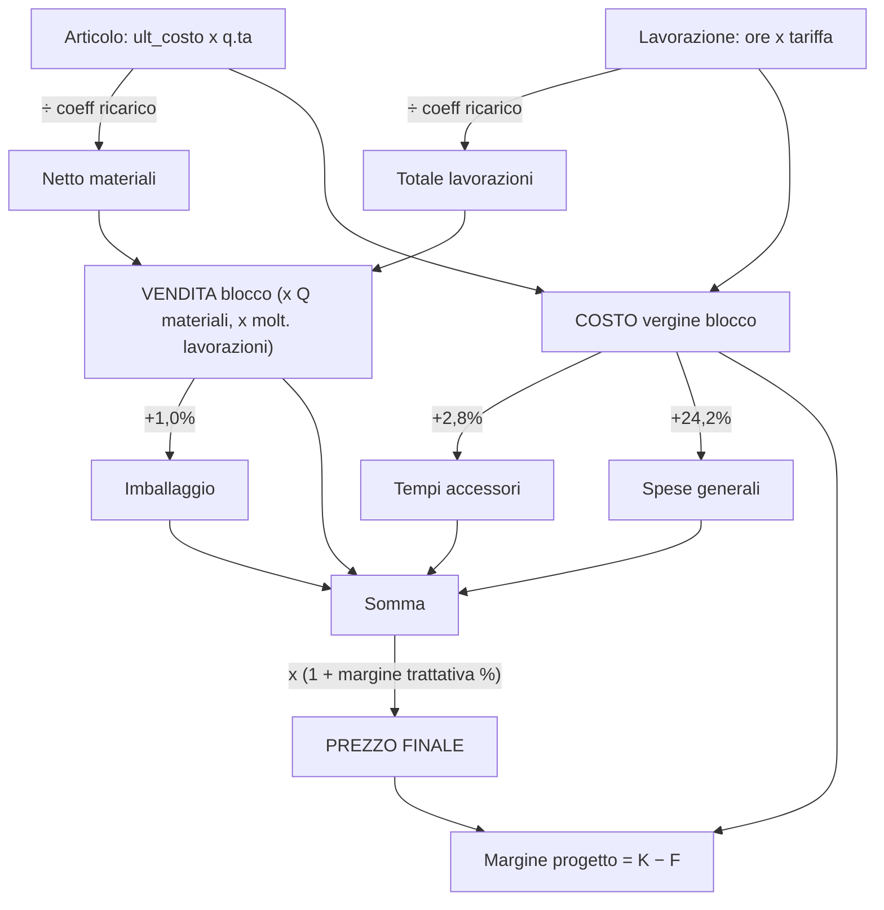
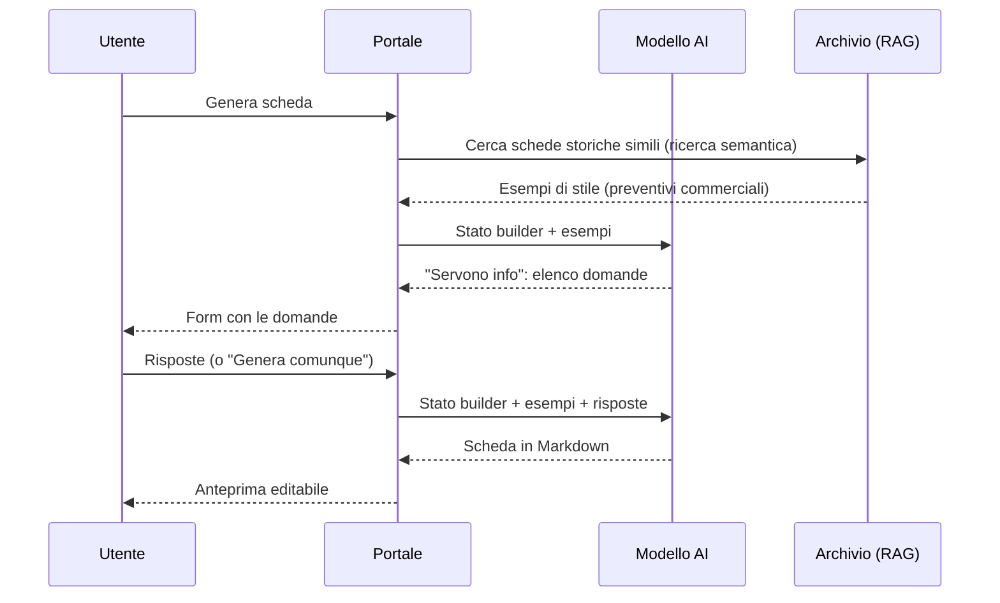
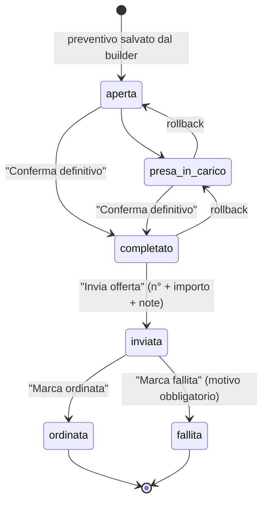
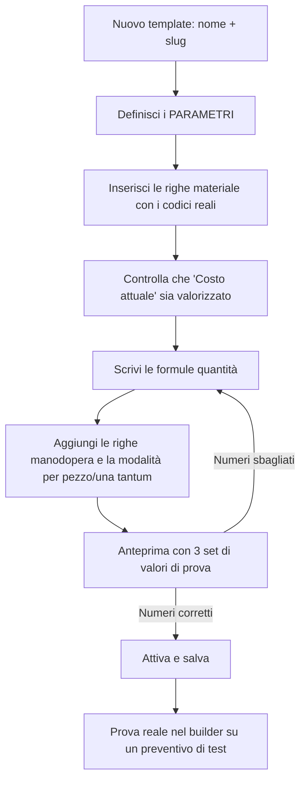
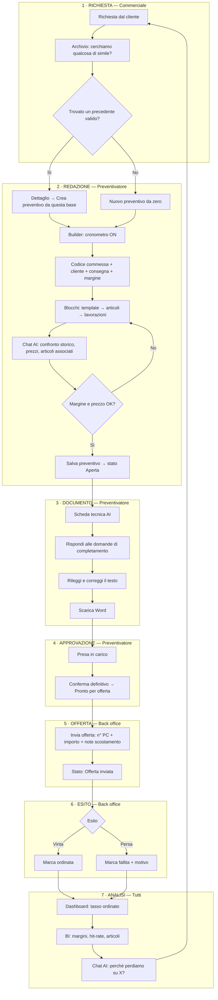

# Portale Preventivatore SICS — Manuale di formazione

> Documento operativo per gli addetti (commerciali, preventivatori, back office, amministratori).
> Copre **tutte** le pagine del portale, da dove arrivano i dati, cosa si può fare in ciascuna, con esempi pratici e lo schema del flusso di lavoro completo.

---

## Indice

1. [Cos'è il Preventivatore e cosa cambia nel lavoro quotidiano](#1-cosè-il-preventivatore-e-cosa-cambia)
2. [Accesso, ruoli e cosa vede ciascuno](#2-accesso-ruoli-e-cosa-vede-ciascuno)
3. [Mappa del portale (tutte le pagine)](#3-mappa-del-portale)
4. [Il modello di calcolo SICS (da capire PRIMA di preventivare)](#4-il-modello-di-calcolo-sics)
5. [Pagina: Dashboard](#5-pagina-dashboard)
6. [Pagina: Nuovo preventivo (il Builder)](#6-pagina-nuovo-preventivo--il-builder)
7. [La Scheda tecnica AI](#7-la-scheda-tecnica-ai)
8. [Pagina: Archivio](#8-pagina-archivio)
9. [Pagina: Dettaglio preventivo](#9-pagina-dettaglio-preventivo)
10. [L'AI Copilot (chat)](#10-lai-copilot-chat)
11. [Pagina: BI](#11-pagina-bi)
12. [Pagina: Impostazioni (solo admin)](#12-pagina-impostazioni--solo-admin)
13. [Pagina: Template prodotti (solo admin)](#13-pagina-template-prodotti--solo-admin)
14. [Il flusso di lavoro completo, schematizzato](#14-il-flusso-di-lavoro-completo)
15. [Esercitazioni guidate](#15-esercitazioni-guidate)
16. [Glossario e FAQ](#16-glossario-e-faq)

---

## 1. Cos'è il Preventivatore e cosa cambia

Il Preventivatore è il portale che **sostituisce i file Excel di preventivazione** con:

- un **builder a blocchi** che calcola prezzi, ricarichi, spese e margine con le regole SICS già codificate;
- un **archivio unico** di tutti i preventivi (storici importati dagli Excel + nuovi generati);
- un **assistente AI** che interroga lo storico (prezzi, articoli, clienti, margini, hit-rate) in linguaggio naturale;
- una **BI configurabile** per costruirsi i propri grafici;
- un **workflow di stato** condiviso tra commerciale, preventivatore e back office.

### Le tre differenze pratiche rispetto a prima

| Prima (Excel) | Adesso (Portale) |
|---|---|
| Ogni preventivo è un file su una cartella | Ogni preventivo è un record consultabile, ricercabile e confrontabile |
| I costi articolo si copiano a mano dal listino | I costi arrivano **live** dall'anagrafica Cruscotto (`prodotti.ult_costo`) e si evidenziano se vecchi |
| Ricerca "ho già fatto una cosa simile?" = memoria personale | Ricerca semantica + AI Copilot sull'intero archivio |
| Lo stato dell'offerta sta nella testa o in una mail | Stato tracciato nel workflow (aperta → … → ordinata/fallita) |

### Due tipi di preventivo convivono nel sistema

- **`storico`** — importato dagli Excel/Word di preventivazione (ingestion). Si consulta, si analizza, si può usare come base, **non** si modifica nel builder.
- **`generato`** — creato dal builder del portale. Modificabile, duplicabile, con workflow di stato attivo.

---

## 2. Accesso, ruoli e cosa vede ciascuno

### 2.1 Accesso al portale

Il portale è dentro l'intranet SICS. Il layout controlla **due cose** ad ogni caricamento:

1. sei autenticato? altrimenti → `/auth/login`;
2. hai un livello di accesso sul portale `preventivatore`? altrimenti → torni alla home intranet.

### 2.2 Livelli di portale (permessi tecnici)

Gerarchia crescente: **`viewer` → `exporter` → `admin` → `superadmin`**.

| Livello | Cosa sblocca |
|---|---|
| `viewer` | Dashboard, BI (dashboard personale), Nuovo preventivo, Archivio, Chat AI |
| `exporter` | + salvataggio dashboard **Team** in BI, + "Correggi totali" sul dettaglio |
| `admin` | + voce **Impostazioni** in sidebar, + Template prodotti, + cambio stato preventivi |
| `superadmin` | + può riportare in workflow un preventivo archiviato/legacy |

### 2.3 Ruoli funzionali (chi fa cosa nel processo)

Sono assegnati per utente e governano il **workflow**: `commerciale`, `preventivatore`, `back_office`.

| Ruolo | Transizioni di stato che può fare |
|---|---|
| `commerciale` | riportare a `aperta` |
| `preventivatore` | `presa_in_carico`, `completato` |
| `back_office` | `inviata`, `ordinata`, `fallita` |

> Chi ha livello portale `admin`/`superadmin` bypassa questo controllo.

### 2.4 Il filtro "vedo solo i miei clienti"

Un utente è **commerciale ristretto** quando:

- ha il ruolo funzionale `commerciale`, **e**
- **non** ha `preventivatore` né `back_office`, **e**
- ha un codice agente assegnato (`utenti.preventivatore_agente_codice`), **e**
- non è `admin`/`superadmin`.

In quel caso vede **solo** i preventivi dei clienti del suo codice agente **+ tutti i clienti `AIRFLUID`** (il portfolio "casa SICS", visibile a tutti i commerciali).

Il filtro è applicato in modo coerente ovunque: elenco archivio, dettaglio, dashboard, BI, ricerca semantica **e anche ai tool dell'AI Copilot**. Se un commerciale chiede alla chat "quanti preventivi abbiamo per il cliente X" e X non è suo, la chat non lo vede.

---

## 3. Mappa del portale

```
/preventivatore                      → redirect a /preventivatore/dashboard
/preventivatore/dashboard            → Dashboard (KPI ultimi 12 mesi)
/preventivatore/bi                   → BI configurabile (dashboard personale / team)
/preventivatore/nuovo                → Builder nuovo preventivo
   ?base=<id>                        →   … precompilato da un preventivo esistente (prezzi AGGIORNATI)
   ?edit=<id>                        →   … riapertura in modifica (prezzi CONGELATI)
/preventivatore/archivio             → Elenco preventivi + ricerca AI + Copilot
/preventivatore/archivio/<id>        → Scheda dettaglio di un preventivo
/preventivatore/impostazioni         → [admin] Config AI, lavorazioni, statistiche
/preventivatore/impostazioni/template→ [admin] Template prodotti (parametri + formule)
```

La **sidebar** scura a sinistra mostra: Dashboard · BI · Nuovo preventivo · Archivio, e in fondo il tuo nome con il livello di accesso. La voce **Impostazioni** compare solo se sei almeno `admin`.

---

## 4. Il modello di calcolo SICS

> **Questa è la parte più importante di tutto il manuale.** Se si capisce questo schema, ogni numero mostrato dal portale diventa leggibile.

### 4.1 Il coefficiente di ricarico (convenzione SICS)

Il portale **non** usa "ricarico +100%". Usa il **coefficiente**, esattamente come gli Excel storici:

```
prezzo di vendita = costo ÷ coefficiente
```

| Coefficiente | Moltiplicatore effettivo | Lettura |
|---|---|---|
| `0,50` | × 2,00 | costo raddoppiato (default materiali) |
| `0,65` | × 1,538 | ricarico ~54% |
| `0,70` | × 1,428 | ricarico ~43% (default manodopera nei template) |
| `1,00` | × 1,00 | nessun ricarico |

**Più basso è il coefficiente, più alto è il prezzo.** Il default per una riga nuova nel builder è `0,50`.

- Riga materiale: `netto = ult_costo × q.tà ÷ coeff_ricarico`
- Riga lavorazione: `totale = ore × tariffa_ora ÷ coeff_ricarico`

### 4.2 Quantità pezzi del blocco (Pz) e lo switch ÷Q / 1×

Ogni blocco ha un campo **Pz** = quanti pezzi identici produrre.

- **Materiali**: scalano sempre con Q → `× Q`.
- **Lavorazioni**: dipende dallo switch nella colonna *Tipo*:
  - **`÷Q`** → il tempo inserito è riferito all'**intero lotto** e viene **ripartito** sui pezzi (`÷ Q`). Tipico di Lavorazione/Montaggio/Collaudo.
  - **`1×`** → **una tantum**, contata una volta sola indipendentemente da Q. Tipico di Progettazione, Manuale, Documentazione.

> Errore classico: lasciare la Progettazione su `÷Q`. Con Q=10 il costo di progettazione si divide per 10 e il prezzo crolla. **Controllare sempre la colonna Tipo.**

### 4.3 Add-on e prezzo finale

Per ogni blocco, con `Q` pezzi:

```
vendita   = Σ materiali(×Q) + Σ lavorazioni(×molt.)      ← con ricarico
costo     = Σ costi materiali(×Q) + Σ costi lavorazioni  ← "vergine", senza ricarico

imballaggio      = vendita × 1,0 %      ← sul PREZZO DI VENDITA
tempi accessori  = costo   × 2,8 %      ← sul COSTO
spese generali   = costo   × 24,2 %     ← sul COSTO

prezzo finale blocco = (vendita + imballaggio + tempi + spese) × (1 + margine trattativa %)
```

Il **margine trattativa** è quello globale del preventivo, salvo override sul singolo blocco.

### 4.4 Il "Margine progetto" mostrato nel footer

```
margine € = prezzo finale totale − costo vergine totale
margine % = margine € ÷ costo vergine totale × 100
```

Attenzione: è il **ricarico sul costo**, non la marginalità sul ricavo. Un margine "+120%" significa che il prezzo è 2,2 volte il costo.

### 4.5 Schema visivo



---

## 5. Pagina: Dashboard

**URL:** `/preventivatore/dashboard` · **Chi:** tutti · **Finestra:** ultimi 12 mesi

### Da dove prende i dati

Chiama `GET /api/portali/preventivatore/dashboard`, che esegue in parallelo 6 funzioni sul database (`dashboard_kpi`, `dashboard_top_clienti`, `dashboard_serie_mensile`, `dashboard_serie_mensile_categoria`, `dashboard_top_articoli`, `dashboard_attivita_recente`) più una lettura di `ai_usage_events` per la spesa AI del mese.

**Tutte le funzioni ricevono il codice agente**: se sei commerciale ristretto, i numeri sono già filtrati sul tuo portfolio. Non esiste una "vista globale nascosta".

### Cosa vedi

| Elemento | Significato | Nota |
|---|---|---|
| **Preventivi totali** | conteggio ultimi 12 mesi + sparkline | delta % vs periodo precedente |
| **Valore totale** | somma `importo_preventivo` | in k€/M€ abbreviato |
| **Clienti attivi** | clienti distinti nel periodo | |
| **Tasso ordinato** | `ordinati ÷ (ordinati + rifiutati) × 100` | **non conta i pending** |
| **Top Clienti** | 5 clienti per valore, con barra proporzionale | il chip a destra = n° preventivi |
| **Preventivi mensili** | barre impilate per categoria (nastri, scale, protezioni, strutture, automazioni, altro) | passa il mouse sulle barre per il dettaglio |
| **Attività recente** | ultimi 6 preventivi con pallino colorato di stato | badge "Generato" = creato dal builder |
| **Articoli più ricorrenti** | top 5 codici per numero di occorrenze in distinta | |
| **AI Copilot** | card scura con la mascotte e la spesa AI del mese | scorciatoie ad Archivio e Nuovo |

### Il banner arancione "Workflow stati non attivo"

Compare quando **tutti** i preventivi sono ancora `pending`: senza stati marcati il tasso di conversione non è calcolabile e la card "Tasso ordinato" resta a `—` con etichetta *In arrivo*.

> **Azione richiesta agli addetti:** marcare sistematicamente gli stati. È l'unica cosa che abilita i KPI commerciali.

---

## 6. Pagina: Nuovo preventivo — il Builder

**URL:** `/preventivatore/nuovo` · **Chi:** tutti · Il cuore operativo del portale.

### 6.1 Le tre modalità di apertura

| Come ci arrivi | URL | Comportamento sui prezzi |
|---|---|---|
| Da zero | `/preventivatore/nuovo` | Un blocco vuoto, tutto da compilare |
| **Da base** (dal dettaglio → *Crea preventivo da questa base*) | `?base=<id>` | Ricarica struttura e **aggiorna i prezzi ai valori correnti**, mostrando un avviso con quanti costi/tariffe sono cambiati |
| **In modifica** (dal dettaglio → *Modifica*, solo preventivi `generato`) | `?edit=<id>` | **Prezzi congelati** com'erano al salvataggio. Il codice commessa non è modificabile |

Il banner verde dopo una duplicazione dice esattamente cosa è successo, ad esempio:

> *Preventivo duplicato. 12 prezzi articolo aggiornati · 2 tariffe manodopera aggiornate · 1 codice non più in anagrafica (mantenuto il costo originale).*

In modalità **modifica** compare il pulsante **Aggiorna prezzi**: allinea on-demand i costi articolo e le tariffe lavorazioni ai valori correnti, dicendoti quante righe ha toccato.

### 6.2 Intestazione del preventivo

| Campo | Obbligatorio | Da dove | Note |
|---|---|---|---|
| **Codice commessa** | **Sì** (in creazione) | manuale | Es. `2026-0142`. È **univoco**: se esiste già, il salvataggio fallisce con errore esplicito |
| Titolo preventivo | no | manuale | Es. *Impianto scale Montenegro* |
| **Cliente** | **Sì** | anagrafica `clienti_master` (sincronizzata dal Cruscotto) | Selezione a 2 step, vedi sotto |
| Consegna stimata | no | manuale | Range in settimane (min – max) |
| Margine trattativa % | no | manuale | Applicato a tutti i blocchi salvo override |

**Autocomplete cliente a 2 livelli** — importante, perché in anagrafica lo stesso cliente ha molte destinazioni:

1. digiti la ragione sociale → vedi **un'entry per cliente** con l'indicazione *"N sedi"*;
2. selezioni il cliente → si apre l'elenco delle **destinazioni/divisioni**; scegli quella giusta.
   - se il cliente ha **una sola** destinazione viene selezionata automaticamente;
   - la sede principale è marcata *(sede principale)*.

> Esempio reale: *IMA spa* può avere decine di destinazioni (`IMA spa-div.SAFE`, ecc.). Scegliere quella sbagliata significa attribuire il preventivo al commerciale sbagliato.

Sotto l'intestazione una riga di **statistiche live**: Blocchi · Articoli · Ore totali · Totale.

### 6.3 Il cronometro di preventivazione

In alto a destra c'è un cronometro (Avvia / Pausa / Azzera). Misura quanto tempo impieghi a redigere il preventivo:

- lo stato è salvato nel browser, sopravvive a ricariche e navigazioni;
- si azzera automaticamente al salvataggio;
- il valore finisce sul preventivo (`tempo_preventivazione_sec`) ed è visibile nel dettaglio come **Tempo redazione**;
- riaprendo un preventivo in modifica, riparte dal tempo già registrato.

> Serve a misurare la produttività del processo, non le persone. Va usato con onestà: avvialo quando inizi, mettilo in pausa quando ti interrompi.

### 6.4 Il blocco: anatomia completa

Un **blocco** = una parte del progetto (un nastro, una scala, le protezioni…). Un preventivo ne ha uno o più.

**Barra del blocco:** pallino colorato · `B1` · **tipo** (Nastro Principale, Rulliera, Protezioni, Scala, Ballatoio, Pedana, Camminamento, Struttura, Impianto elettrico, Altro) · **nome libero** · **Pz** · prezzo/costo · espandi · elimina.

Aprendo il blocco trovi, nell'ordine:

#### a) Genera da template
Menu a tendina con i template attivi. Selezioni il template, compili i **parametri** (larghezza, n° gradini, opzioni SI/no…) e premi **Applica al blocco**: articoli e lavorazioni vengono generati calcolando le formule.
> ⚠️ **Sostituisce** articoli e lavorazioni già presenti nel blocco. Applica il template **prima** di personalizzare a mano.

#### b) Materiali catena / guida (solo template Nastro Flexmove)
Se il template li prevede, cerchi in anagrafica l'articolo **catena** e l'articolo **guida**: il loro prezzo (€/m) entra automaticamente nel costo di ogni componente secondo i metri configurati:
```
ult_costo componente = costo base + m.catena × €/m catena + m.guida × €/m guida
```
Il link *Riepilogo materiali →* apre il totale metri e importi.

#### c) Parametri template
Restano **editabili e vivi**: cambiando un parametro le quantità con formula si ricalcolano all'istante.
> Se modifichi a mano la quantità di una riga con formula, quella riga passa in **override** e la formula smette di sovrascriverla. Le altre continuano a ricalcolarsi.

#### d) Note tecniche
Testo libero del blocco. Finisce nel preventivo salvato e viene letto dall'AI per la scheda tecnica.

#### e) Articoli
Barra di ricerca sull'anagrafica prodotti (~20.000 codici del Cruscotto). Digitando compaiono: codice, descrizione, **costo/unità di misura**, categoria/fornitore, giacenza e n° magazzini. Il chip `?` giallo segnala prezzo aggiornato da oltre un anno.

Se il codice **non esiste** in anagrafica, il menu propone *"Aggiungi «testo» come articolo manuale"*: crei una riga con codice e descrizione liberi e costo a mano. Stesso risultato col pulsante **Voce manuale**.

Colonne della tabella articoli: **Codice · Descrizione · Q.tà · Ult. Costo · Coeff. ricarico · [m.cat / m.guida] · Netto · 🗑**.

- La cella **Ult. Costo diventa gialla** se il costo ha più di **9 mesi**: verificare il prezzo prima di offrire.
- Il campo **Coeff. blocco** in alto a destra + *applica a tutti* imposta lo stesso coefficiente su tutti i materiali del blocco (poi ritoccabile riga per riga).
- Cliccando sul codice di una riga esistente puoi ricercare e **sostituire** l'articolo: descrizione e costo si aggiornano.

#### f) Lavorazioni
Interruttore **Attive / Disattivate** per blocco. Disattivandole i servizi vengono **azzerati** e non incidono sul prezzo (utile per blocchi di sola fornitura materiale).

Il pulsante *Aggiungi lavorazione* apre il picker con il listino da Impostazioni (nome, categoria, tariffa/h). Ogni riga aggiunta è editabile: **Ore**, **Ricarico**, **Tipo (÷Q / 1×)**; tariffa e totale sono calcolati.

Quando `Pz > 1` e la lavorazione è `÷Q`, sotto il totale compare il valore ripartito: `÷10 = € 12,40`.

#### g) Recap economico del blocco
Prezzo vendita (1 pz) · Costo (1 pz) e, se `Pz > 1`, i complessivi. Nota in calce: *imballaggio, spese generali e margine sono applicati nel riepilogo finale*.

### 6.5 Riepilogo blocchi e footer

Sopra i blocchi, la striscia **Riepilogo blocchi**: un chip per blocco (`B1`, `B2`, …) con nome e totale; cliccando ci si sposta e si espande solo quello. Sulla destra l'avviso *"Da completare: cliente · 2 blocchi vuoti"*.

In basso, la **barra sticky** sempre visibile con 4 card:

| Card | Contiene |
|---|---|
| **Materiali** | totale a prezzo di vendita, coeff. medio, n° pezzi, e sotto il costo |
| **Servizi** | totale lavorazioni, coeff. medio servizi, e sotto il costo |
| **Totale** | prezzo finale complessivo + riga *incl. imb. … tempi … spese … marg. +X%* |
| **Margine** | margine € e % sul costo vergine |

E i due pulsanti: **Scheda tecnica** e **Salva Preventivo**.

### 6.6 Salvataggio: cosa controlla il sistema

Il salvataggio è bloccato se manca il cliente, se manca il codice commessa (in creazione) o se non c'è nemmeno un articolo/servizio in un blocco. Lato server la creazione è **atomica**: documento + blocchi + righe distinta o si salva tutto o non si salva nulla.

Errori tipici e cosa significano:

| Messaggio | Causa | Cosa fare |
|---|---|---|
| *Seleziona un cliente prima di salvare* | cliente vuoto | scegli ragione sociale **e** destinazione |
| *Inserisci il codice commessa prima di salvare* | campo vuoto | inserisci il codice |
| *Esiste già un preventivo con il codice commessa "X"* | codice duplicato | usa un codice nuovo, o apri l'esistente in modifica |
| *Cliente fuori dal tuo portfolio* | commerciale ristretto su cliente altrui | verifica l'assegnazione del cliente |

A salvataggio riuscito vieni portato direttamente sulla **scheda dettaglio** del preventivo creato.

### 6.7 Esempio guidato completo — "Scala di accesso, 2 pezzi"

**Obiettivo:** preventivo per 2 scale identiche, con progettazione una tantum.

1. `/preventivatore/nuovo` → **avvia il cronometro**.
2. **Codice commessa**: `2026-0142`. **Titolo**: `Scale accesso linea 3`.
3. **Cliente**: digita `ALPHA` → scegli `ALPHAMAC` → seleziona la destinazione corretta.
4. **Consegna**: `6` – `8` settimane. **Margine trattativa**: `5`.
5. Blocco B1 → tipo **Scala**, nome `Scala accesso quadro`, **Pz = 2**.
6. *Genera da template* → **Scala** → parametri: `n_gradini = 7`, `larghezza = 800` → **Applica al blocco**.
7. Controlla la distinta generata: le quantità con formula si sono compilate; le righe rimaste a 0 sono quelle da completare a mano.
8. Aggiungi un articolo fuori template: cerca `profilato 170x40` → selezionalo → q.tà `4`.
9. Una cella *Ult. Costo* è **gialla** → il costo è vecchio: verifica con l'ufficio acquisti e, se serve, correggilo a mano nella cella.
10. **Lavorazioni**: aggiungi `PROGETTAZIONE` (3 h) e mettila su **`1×`**; aggiungi `MONTAGGIO` (10 h) e lasciala su **`÷Q`**.
11. Guarda il recap: `Prezzo vendita (1 pz)` e `Prezzo vendita compl. (2 pz)`.
12. Nel footer verifica **Totale** e **Margine**. Se il margine è troppo basso, agisci nell'ordine: coeff. ricarico materiali → ore lavorazioni → margine trattativa.
13. Apri la **chat** a destra e chiedi: *"Confronta questo blocco con scale simili degli ultimi 2 anni: siamo alti o bassi di prezzo?"*
14. **Salva Preventivo** → il cronometro si azzera e atterri sulla scheda dettaglio.

---

## 7. La Scheda tecnica AI

**Dove:** pulsante *Scheda tecnica* nel footer del builder.

È la **descrizione di fornitura da mandare al cliente**, generata dall'AI a partire dal preventivo che stai costruendo e **imitando lo stile delle schede storiche** realmente inviate.

### Come funziona (2 fasi)



**Fase 1 — le domande.** Di default l'AI chiede sempre chiarimenti, perché la distinta materiali da sola non basta per una scheda seria (mancano sviluppo geometrico, finiture, formati, perimetro della fornitura). Compili le risposte e generi, **oppure** premi *Genera comunque* per saltare.

**Fase 2 — la scheda.** Struttura tipica prodotta:

```
Spett.le <cliente> / Alla c.a. / Oggetto
Descrizione fornitura:  (paragrafo discorsivo su scopo e dimensioni)
CARATTERISTICHE TECNICHE <TIPO>:  (elenco puntato)
Compreso nella fornitura:
Escluso dalla fornitura:
```

### Regole inviolabili della scheda

- ❌ **niente prezzi**
- ❌ **niente codici interni SICS** (solo serie/codici commerciali)
- ❌ **niente tabelle**
- ❌ **niente ore, lavorazioni o fasi di officina**

### Cosa puoi fare nell'anteprima

- **Modificare il testo** direttamente (è un'area editabile: correggi sempre prima di inviare);
- **Rigenera** — nuova versione;
- **Copia testo** — versione ripulita dal markdown, per incollarla in una mail;
- **Scarica Word** — `.docx` con titoli veri, tabelle Word e formattazione (nome file `scheda-tecnica_<cliente>_<data>.docx`).

Ogni generazione è tracciata (modello, provider, token, costo) per audit.

> **La scheda AI è una bozza professionale, non un documento firmato.** Rileggila sempre: l'AI può inferire caratteristiche non confermate.

---

## 8. Pagina: Archivio

**URL:** `/preventivatore/archivio` · **Chi:** tutti (filtrato per portfolio)

### Da dove prende i dati

`GET /api/portali/preventivatore/documenti` con filtri, ordinamento e paginazione (20 per pagina). In modalità AI usa invece `POST /api/portali/preventivatore/search` (ricerca vettoriale sui chunk).

### Due modalità di ricerca

**1) Ricerca classica** — scrivi nella barra e la ricerca è testuale su **codice, numero offerta, cliente**.

**2) "Cerca con AI"** (o `Invio`) — **ricerca semantica** sull'intero contenuto dei preventivi. Trova per *significato*, non per parola esatta. I risultati sono ordinati per **% di similarità** e mostrano l'estratto più pertinente.

| Domanda | Usa |
|---|---|
| "il preventivo S_24_118" | ricerca classica |
| "tutti quelli di ALPHAMAC" | filtro Cliente |
| "scale con ballatoio e balaustra in alluminio" | **Cerca con AI** |
| "qualcosa di simile a un nastro con motoriduttore laterale" | **Cerca con AI** |

Per uscire dalla modalità AI: la **✕** nella barra di ricerca.

### Filtri e ordinamento

Filtri: **Stato** (tutti / in attesa / ordinato / rifiutato) · **Cliente** (elenco reale dei clienti presenti) · **Tipo** (storico / generato) · **Importo min** · **Importo max**.
Il pulsante *Pulisci (N)* azzera tutto.

Ordinamento cliccabile su: Data inserimento · Data offerta · Numero preventivo · Cliente · Importo · Stato (secondo click inverte).

### Cosa puoi fare da qui

- **Cliccare una card** → apre il **dettaglio** del preventivo.
- **Menu Azioni** su ogni card:
  - **Segna come Ordinato** → chiede *codici articolo* (separati da virgola), *importo concordato* (opzionale) e *note*;
  - **Segna come Rifiutato** → richiede obbligatoriamente il **motivo** da elenco;
  - **Lascia Pending**.
- Usare l'**AI Copilot** nella colonna destra (vedi §10).

> ⚠️ Queste azioni rapide usano gli stati **legacy** (`pending`/`ordinato`/`rifiutato`) e richiedono livello `admin`. Per i preventivi **generati** dal builder si usa il **workflow completo** dalla scheda dettaglio (§9.4).

---

## 9. Pagina: Dettaglio preventivo

**URL:** `/preventivatore/archivio/<id>`

La pagina è caricata lato server e **riverifica il portfolio**: se il preventivo non è tuo, restituisce "non trovato".

### 9.1 Barra azioni in alto

| Pulsante | Quando compare | Cosa fa |
|---|---|---|
| **Archivio** | sempre | torna all'elenco |
| **Modifica** | solo preventivi `generato` | riapre nel builder a **prezzi congelati** |
| **Crea preventivo da questa base** | sempre | nuovo preventivo con la stessa struttura e **prezzi aggiornati** |
| **Correggi totali** | sempre (agisce solo con livello admin/exporter) | correzione manuale dei totali estratti dall'ingestion |

### 9.2 Intestazione

Codice · badge di stato · badge "Generato" · cliente · numero offerta · data · categoria · tipo prodotto · anno · versione di ingestion.
A destra il **Prezzo preventivo**, l'eventuale **→ ordinato €** e la *fonte* dell'importo.

Riga statistiche: Blocchi · Articoli · Ore tot. · Codici unici · Consegna · Margine tratt. · **Tempo redazione**.

### 9.3 Contenuto (cambia in base al tipo)

**Preventivo `generato` (dal builder):**
- **Riepilogo economico complessivo** — tabella: Costo complessivo (vergine) → Prezzo di vendita base → Imballaggio → Tempi accessori → Spese generali → **Prezzo finale**; accanto la card verde **Margine progetto** (€ e % sul costo).
- **Blocchi progetto** — per ciascuno: pezzi, prezzo per pezzo e complessivo, **Distinta materiali** e **Lavorazioni e manodopera** con q.tà, costo unitario, coefficiente, prezzo di vendita.

**Preventivo `storico` (da Excel):**
- **Documenti** — i testi commerciali/note importati dai Word, con *Apri documento* (versione formattata) e **Riassumi con AI**.
- **Blocchi progetto** ricostruiti dai fogli Excel, con distinta, lavorazioni e **Totali** del foglio.
- Se l'ingestion ha catturato valori anomali, il portale lo dichiara: *"Margine trattativa nel foglio Excel non riconosciuto"*, *"prezzo finale Excel anomalo"* — e in alcuni casi lo **ricalcola** da totale + margine.

### 9.4 Workflow di stato (preventivi generati)

I pulsanti compaiono **solo per lo stato in cui ti trovi**:



| Stato | Etichetta a schermo | Chi lo imposta |
|---|---|---|
| `aperta` | Aperta | commerciale / preventivatore / back office |
| `presa_in_carico` | Presa in carico | preventivatore |
| `completato` | Pronto per offerta | preventivatore |
| `inviata` | Offerta inviata | back office |
| `ordinata` | Ordinata | back office |
| `fallita` | Fallita | back office |
| `storico` | Archivio storico | — (import) |

Regole rigide applicate dal server:

- **Da `ordinata`/`fallita` non si torna indietro.**
- Passare a `inviata` richiede il **numero offerta (PC N°)**; puoi indicare importo offerta e note di scostamento (es. *"trattativa −5%"*).
- Passare a `fallita` richiede il **motivo** da elenco.
- Riportare in workflow un preventivo `storico` o legacy è consentito **solo al superadmin**.

### 9.5 Correggi totali

Riservato a `admin`/`exporter`/`superadmin`: permette di correggere `importo_preventivo` e i totali estratti da un foglio Excel quando l'ingestion ha letto la cella sbagliata. Serve a **ripulire lo storico**, così le analisi e l'AI lavorano su numeri veri.

---

## 10. L'AI Copilot (chat)

Presente in **due punti**, con comportamenti diversi:

| Dove | Contesto | Specificità |
|---|---|---|
| **Archivio** (colonna destra) | `archivio` | Analisi, ricerche e statistiche sullo storico |
| **Nuovo preventivo** (colonna destra) | `nuovo` | Riceve anche lo **snapshot live del preventivo che stai costruendo** |

### 10.1 Comandi dell'interfaccia

- **Modalità Precisa / Creativa** (interruttore in alto):
  - **Precisa** — riporta **solo** i dati trovati in archivio: codici, quantità, prezzi, ore. Se un'informazione non c'è, lo dichiara. Temperatura bassa.
  - **Creativa** — usa i dati come base e aggiunge ragionamento commerciale: pattern tra ordinati e rifiutati, rischi di pricing, posizionamento di prezzo. **Distingue sempre i dati certi dalle proprie osservazioni.**
  Le risposte creative hanno il fondo arancione, quelle precise grigio.
- **🕘 Storico conversazioni** — le chat sono salvate: puoi riaprirle, rinominarle di fatto col primo messaggio, eliminarle, o partire con *Nuova chat*.
- **⛶ Schermo intero** — apre la chat a tutta pagina con la barra laterale dell'archivio conversazioni (`Esc` per uscire).
- **Contatore spesa** — se abilitato in Impostazioni: spesa AI **Oggi / 30 gg / Chat** in dollari.

**Limite:** massimo 30 messaggi al minuto per utente.

### 10.2 Cosa sa fare davvero (i tool)

L'AI non "immagina" i numeri: chiama funzioni sul database. Ecco l'elenco completo e quando si attivano.

| Tool | Serve per | Esempio di domanda |
|---|---|---|
| `list_preventivi` | elenco/filtri/soglie di importo | *"quanti preventivi sopra 50.000 € nel 2025?"* |
| `cerca_simili` | ricerca **semantica a livello di blocco** | *"a quale preventivo somiglia il blocco che sto costruendo?"* |
| `cerca_articolo` | testo nelle distinte materiali | *"chi usa l'articolo 4505000?"* |
| `aggrega_preventivi` | group-by e statistiche | *"valore totale per stato"*, *"preventivi per mese"* |
| `top_articoli` | codici più ricorrenti | *"top 10 codici nelle scale"* |
| `query_righe_distinta` | prezzi e costi delle **singole voci** | *"qual è l'articolo con il prezzo unitario più alto?"* |
| `dettaglio_preventivo` | **tutto** un singolo preventivo | *"dammi la distinta completa di S_24/041"* |
| `analisi_preventivi_sql` | analisi numeriche affidabili | *"statistiche per categoria 2026"*, *"controllo qualità dati"* |
| `cerca_anomalie_importi` | preventivi fuori range (z-score) | *"quali preventivi sono molto sopra la media cliente?"* |
| `cerca_articolo_anagrafica` | catalogo prodotti + **fornitori** | *"chi è il fornitore del codice X?"*, *"cosa abbiamo da WURTH"* |
| `listino_servizi` | tariffe lavorazioni attive | *"qual è la tariffa del MONTAGGIO?"* |
| `storia_prezzi_articolo` | andamento prezzo nel tempo | *"come è cambiato il costo di AFD.00.1.10036.0?"* |
| `analisi_margini` | scostamento preventivato vs ordinato | *"su quali categorie abbiamo i margini migliori?"* |
| `hit_rate` | tasso di conversione | *"qual è il nostro hit-rate su ALPHAMAC negli ultimi 12 mesi?"* |
| `info_cliente` | scheda cliente completa | *"parlami del cliente CURTI"*, *"chi è il commerciale di Y?"* |
| `articoli_associati` | market basket | *"cosa metto solitamente insieme al codice X?"* |
| `trend_mensile` | serie mensile per categoria | *"in quale mese facciamo più preventivi?"* |

> Tutti i tool rispettano il **filtro portfolio**: un commerciale ristretto non può estrarre dati di clienti non suoi neanche via chat.

### 10.3 Come vengono mostrati i risultati

Oltre al testo, la chat disegna schede specifiche: elenchi di preventivi con badge di stato e importo, risultati semantici con la **% di similarità**, barre di frequenza per gli articoli, tabelle di distinta con codici/quantità/prezzi, e per il dettaglio di un preventivo le tabelle complete di materiali, manodopera e prezzo finale — così puoi **verificare i numeri alla fonte** senza fidarti dell'interpretazione dell'AI.

### 10.4 Esempi mirati per contesto

**Nell'Archivio (analisi e commerciale)**

```
Quali sono i 5 preventivi più alti del 2026 e in che stato sono?
Confronta il valore totale ordinato 2025 vs 2026 per categoria.
Qual è il nostro hit-rate su ALPHAMAC negli ultimi 24 mesi?
Trova preventivi anomali per importo del cliente CURTI.
Quanto costa oggi il codice AFD.00.1.11191.0 e come è cambiato negli ultimi 5 anni?
Dammi la distinta completa di S_24/041.
Su quali categorie applichiamo mediamente più sconto rispetto al preventivato?
Chi è il fornitore del codice 4505000 e cos'altro compriamo da lui?
```

**Nel Builder (mentre costruisci)** — qui la chat **vede** il tuo preventivo:

```
Guarda il preventivo che sto costruendo: il margine è in linea con lavori simili?
Cerca preventivi storici con una configurazione simile al blocco B1.
Quali articoli mettiamo di solito insieme a quelli che ho già inserito?
Mi manca qualcosa di tipico in una scala di accesso rispetto agli storici?
Qual è la tariffa a listino della lavorazione MONTAGGIO?
Questo cliente in passato ha accettato preventivi di questo importo?
```

### 10.5 Buone pratiche per parlare con la chat

| ✅ Fai così | ❌ Evita |
|---|---|
| Cita **codici esatti** quando li hai | "quel codice del nastro" |
| Indica il **periodo** ("nel 2025", "ultimi 12 mesi") | domande senza tempo su dati storici |
| Chiedi **una cosa per volta** in modalità Precisa | domande a grappolo confuse |
| Usa **Creativa** per pareri e posizionamento | usare Creativa e citare i suoi numeri come certi |
| **Verifica** i numeri nelle schede risultato | copiare la risposta in offerta senza controllo |

> **Regola d'oro:** la modalità **Precisa** è per i numeri, la **Creativa** è per le idee. Nulla che esca dalla chat va in un'offerta al cliente senza verifica umana.

---

## 11. Pagina: BI

**URL:** `/preventivatore/bi` · **Chi:** tutti (dashboard personale); il salvataggio **Team** richiede `admin`/`exporter`.

È un costruttore di dashboard: scegli dataset, metrica, raggruppamento e tipo di grafico.

### 11.1 Struttura della pagina

- **Personale / Team** — due dashboard distinte. Personale è tua; Team è condivisa.
- **Vista / Modifica** — in *Modifica* i widget si spostano (icona griglia) e si ridimensionano (angolo in basso a destra), e compare l'**Editor widget** a destra.
- **Salva** — persiste la configurazione (ogni salvataggio sulla Team è tracciato: chi, quando, quanti widget).
- **Filtri globali** — Anno · Cliente · Categoria, applicati a tutti i widget tranne quelli marcati *Ignora filtri globali*.
- **AI proposta grafico** — descrivi a parole il grafico e viene creato il widget.

### 11.2 Dataset e campi disponibili

| Dataset | Contiene | Limite righe caricate |
|---|---|---|
| `documenti` | un record per preventivo | 5.000 |
| `righe_distinta` | una riga per voce di distinta (con i campi del preventivo) | 12.000 |

**Campi:** Anno · Mese · Cliente · Categoria · Tipo prodotto · Stato · Tipo record · Numero offerta · Importo preventivo · Importo ordinato · Codice articolo · Descrizione · Quantità · Prezzo unitario · Coeff. ricarico · Totale riga.

**Metriche:** `count` · `sum` · `avg` · `min` · `max`.
**Tipi di grafico:** `kpi` · `bar` · `stacked_bar` · `line` · `combo` · `donut` · `table`.

> Se compare il banner giallo **"Dataset troncato"** significa che il dataset supera il limite e i risultati sono parziali: restringi con i filtri globali (es. un anno alla volta).
> Il banner rosso **"Widget rifiutati"** indica una configurazione con campi non ammessi — succede tipicamente con proposte AI fuori schema.

### 11.3 Dashboard di default

Alla prima apertura trovi già pronti: 4 KPI (preventivi totali, valore, importo medio, ore preventivazione) · barre impilate **mese × categoria** · barre **valore per cliente** · donut **distribuzione categorie** · linea **importo medio mensile** · barre **stato preventivi** · tabella **top articoli per valore**.

### 11.4 Esempi mirati — creare un widget

**A) "Valore ordinato per cliente, solo 2026"**
1. *Modifica* → **+ Widget**
2. Titolo: `Ordinato per cliente 2026`
3. Tipo: `bar` · Dataset: `documenti`
4. Metrica: `sum` + `Importo ordinato`
5. Raggruppa per: `Cliente`
6. Filtro globale **Anno = 2026**
7. **Salva**

**B) "Quali articoli pesano di più a valore"**
- Tipo `table` · Dataset `righe_distinta` · Metrica `sum` + `Totale riga` · Raggruppa per `Codice articolo`.

**C) "Andamento mensile per categoria"**
- Tipo `stacked_bar` · Dataset `documenti` · Metrica `count` · Raggruppa per `Mese` · Impila per `Categoria`.

**D) "KPI che ignora i filtri globali"**
- Tipo `kpi` · Metrica `count` · spunta **Ignora filtri globali** → resta il totale assoluto anche filtrando per anno.

**E) Con l'AI**
- Nel riquadro *AI proposta grafico* scrivi: `mostrami il valore dei nastri per cliente` → **Genera proposta**. Il widget appare in fondo, già selezionato e in modifica: correggilo e salva.
  Se l'AI non è disponibile, il sistema propone comunque un widget sensato in base alle parole chiave (articoli / cliente / categoria / mese).

> ⚠️ **Attenzione al salvataggio Team:** sovrascrive la dashboard di tutti. Prova sempre prima sulla Personale.

---

## 12. Pagina: Impostazioni — solo admin

**URL:** `/preventivatore/impostazioni` · Se non sei admin vieni rimandato all'archivio.

Tre blocchi: **Configurazione AI**, **Servizi e Lavorazioni**, **Statistiche Documenti**. In alto a destra il link a **Template prodotti →**.

### 12.1 Configurazione AI — le sezioni

#### Generale
| Chiave | Cosa controlla |
|---|---|
| `company_knowledge` | **Profilo aziendale** iniettato in testa a ogni prompt: ragione sociale, sede, certificazioni, gamma prodotti, settori, punti di forza. È la "memoria" dell'AI su SICS |
| `ai_cost_counter_enabled` | Mostra/nasconde agli utenti il contatore di spesa nella chat |

#### Modelli AI
Quattro campi, ognuno con **ricerca + elenco dei modelli OpenRouter** (nome, costo input/output per milione di token, dimensione del contesto) e una casella con l'**ID salvato** (formato `openrouter:provider/modello`).

| Chiave | Usato da | Se vuoto |
|---|---|---|
| `modello_generazione` | chat AI Copilot | fallback interno |
| `modello_embedding` | vettorizzazione per la ricerca semantica | — |
| `modello_scheda_tecnica` | generazione scheda tecnica | eredita quello della chat |
| `modello_template` | assistente AI dei template prodotti | eredita: scheda tecnica → chat |

> Il pulsante **Modelli** ricarica il listino OpenRouter. Se OpenRouter non risponde, il sistema usa **Gemini come fallback** automatico.
> Per `modello_template` è consigliato un modello capace: deve ragionare sulle formule.

#### Chat — modalità Preciso / Creativo
| Chiave | Effetto |
|---|---|
| `system_prompt_preciso` | Istruzioni della modalità Precisa |
| `temperatura_precisa` | Creatività (default ~0,2) |
| `system_prompt_creativo` | Istruzioni della modalità Creativa |
| `temperatura_creativa` | Creatività (default ~0,8) |
| `soglia_similarity` | Quanto devono somigliare i risultati semantici per essere restituiti |
| `max_chunks_per_query` | Quanti frammenti di archivio dare in pasto all'AI |

#### Chat builder
`system_prompt_builder` — istruzioni **aggiuntive** usate solo quando la chat è aperta dentro il configuratore e riceve lo stato del preventivo.

#### Ricerca simili
`soglia_similarity_simili`, `match_count_simili` — regolano il tool `cerca_simili`.

#### Scheda tecnica
| Chiave | Effetto |
|---|---|
| `system_prompt_scheda_tecnica` | **Le regole di scrittura della scheda** (struttura, divieti su prezzi/codici interni/tabelle) |
| `system_prompt_domande_scheda` | Come formulare le domande di completamento |
| `temperatura_scheda_tecnica` | Creatività della scheda (default ~0,4) |
| `soglia_similarity_scheda` | Quanto stretta è la ricerca degli esempi storici |
| `max_esempi_scheda` | Quante schede storiche usare come modello di stile |

### 12.2 Come modificare un prompt — procedura


**Regole d'oro per chi tocca i prompt**

1. **Una modifica per volta.** Se cambi tre cose e peggiora, non saprai quale.
2. **Copia sempre il testo originale** in un blocco note prima di modificarlo: non c'è una cronologia versioni.
3. **Prova subito**: il salvataggio invalida la cache di configurazione e **ha effetto immediato per tutti gli utenti**.
4. **Aggiungi, non riscrivere.** Meglio una riga in più ("Cita sempre il codice articolo quando riporti un prezzo") che rifare il prompt da capo.
5. **Le temperature vanno mosse a passi di 0,1.** Precisa sopra ~0,4 comincia a inventare; Creativa sotto ~0,5 diventa piatta.
6. **`max_chunks_per_query` e `max_esempi_scheda` più alti = risposte più ricche ma più costose e più lente.**
7. **Il profilo aziendale è la fonte della coerenza di brand**: aggiornalo quando cambiano gamma prodotti, certificazioni o recapiti.

**Esempi concreti di intervento**

| Problema riscontrato | Dove intervenire | Modifica suggerita |
|---|---|---|
| In modalità Precisa l'AI aggiunge commenti non richiesti | `system_prompt_preciso` | aggiungi: *"Non aggiungere raccomandazioni o commenti se non esplicitamente richiesti."* |
| Le schede tecniche citano codici interni | `system_prompt_scheda_tecnica` | rafforza: *"Non riportare MAI codici articolo interni SICS: usa solo denominazioni commerciali."* |
| Le schede escono troppo generiche | `max_esempi_scheda` da 4 → 6 | più esempi di stile storico |
| La chat costa troppo | `modello_generazione` | passa a un modello più economico e verifica la qualità |
| L'AI non conosce una linea prodotto nuova | `company_knowledge` | aggiungi la voce nella gamma prodotti |
| L'AI fa troppe domande sulla scheda tecnica | `system_prompt_domande_scheda` | *"Chiedi al massimo 3 domande, solo su informazioni indispensabili."* |

### 12.3 Servizi e Lavorazioni

È il **listino manodopera** che alimenta il picker nel builder.

Colonne: **Ordine · Nome · Categoria · Tariffa/h · Unità · Attivo · azioni**.

- Le modifiche restano **in bozza** (badge *"N non salvate"*) finché non premi **Salva modifiche** (o l'icona 💾 sulla singola riga). *Annulla modifiche* scarta tutto.
- L'interruttore **Attivo** si applica **subito** (non è una bozza): disattivare toglie la lavorazione dal picker senza cancellare lo storico.
- **Aggiungi lavorazione** crea una riga *"Nuova lavorazione"* a 50 €/h da rinominare.
- 🗑 **elimina definitivamente**.

> **Il cambio di tariffa non tocca i preventivi già salvati** (i prezzi sono congelati). Si applica ai nuovi e a chi preme *Aggiorna prezzi* / duplica da base.

### 12.4 Statistiche Documenti

Contatori dell'archivio: **Totale documenti · In attesa · Ordinati · Rifiutati · Chunks totali** (i chunk sono i frammenti vettorizzati che alimentano la ricerca semantica e l'AI).

---

## 13. Pagina: Template prodotti — solo admin

**URL:** `/preventivatore/impostazioni/template`

I template sono **le distinte parametriche** che il builder usa per generare un blocco in un click. Sono l'equivalente strutturato dei vecchi fogli Excel modello.

### 13.1 Struttura di un template

**Intestazione + costanti**
Nome · Descrizione · attivo/off · Imballaggio % (1) · Tempi acc. % (2,8) · Spese gen. % (24,2) · Margine % (5) · Settimane min/max.
Spunta **Componenti con catena/guida (Nastro Flexmove)**: abilita le colonne `m cat.` / `m guida` sulle righe materiale; gli articoli catena e guida (con i loro €/m) si scelgono poi **nel builder**, preventivo per preventivo.

**Parametri di input** — le domande che verranno poste all'operatore.
`Slug` (nome tecnico usato nelle formule) · `Label` · `Tipo` (`number` / `select` / `bool`) · `Unità` · `Default`.

**Righe materiale (distinta)**
`Slug` · `Descrizione` · `Codice` · **Costo attuale** (letto live dall'anagrafica al momento in cui digiti il codice; `n/d` in arancione se il codice non esiste) · `Costo man.` (fallback) · `Ricarico` · `m cat.` / `m guida` · **Formula q.tà**.

**Righe manodopera**
`Lavorazione` · `Tariffa €/h` · `Unità` (h / min) · `Tempo def.` · `Formula tempo` · **Modalità** (`per pezzo` → diventa `÷Q` nel builder; `una tantum` → `1×`) · `Ricarico`.

### 13.2 Il linguaggio delle formule

Le formule non sono codice arbitrario: c'è un motore dedicato e sicuro.

**Puoi usare:** numeri, gli **slug** dei parametri e delle **altre righe**, `+ - * /`, parentesi, confronti (`> < >= <= = <> !=`), `&&` `||` `!`, e le funzioni:

`IF(cond, a, b)` · `AND(...)` · `OR(...)` · `NOT(x)` · `MIN(...)` · `MAX(...)` · `ROUND(x, n)` · `CEIL(x)` · `FLOOR(x)` · `ABS(x)`

**Esempi:**

```
n_gradini * 2                         → due montanti per gradino
(larghezza / 1000) * n_gradini        → millimetri convertiti in metri
fiancate * 2                          → riferimento a un'altra riga tramite il suo slug
IF(profondita > 0, altezza / 1000, 0) → quantità condizionata
CEIL(lunghezza / 3)                   → numero di barre da 3 m, arrotondato per eccesso
IF(cerniere = 1, n_pannelli * 2, 0)   → parametro booleano (SI → 1)
```

Il campo diventa **rosso con ⚠️** se la formula ha un errore di sintassi o cita uno slug inesistente. I parametri `bool` valgono `1` per `SI` e `0` per `no`.

Le righe possono **dipendere l'una dall'altra**: il motore risolve le dipendenze iterando finché i valori si stabilizzano (es. `tubo = fiancate * 2` dove `fiancate` è un'altra riga con formula).

### 13.3 Anteprima live

Il riquadro azzurro in fondo permette di inserire **valori di prova** per i parametri e mostra all'istante: **Costo · Vendita base · Imb.+Tempi+Spese · Prezzo finale**, più il conteggio di materiali con quantità e lavorazioni.

> **Testa sempre almeno 3 combinazioni** (minima, tipica, massima) prima di attivare un template.

### 13.4 L'assistente AI dei template

Nel riquadro fucsia descrivi il template a parole:

> *"Protezione a pannelli modulari con parametri larghezza, altezza e opzione cerniere; distinta con montanti, traversi, pannelli in rete e piastre; lavorazioni taglio, assemblaggio e verniciatura."*

L'AI propone parametri, righe materiale con formule e righe manodopera. Il risultato viene **applicato come bozza** al template aperto: **rivedi tutto e poi salva**. Se un template è già aperto, il pulsante diventa *"Migliora con AI"* e la richiesta parte dalla bozza corrente.

### 13.5 Flusso consigliato per creare un template



---

## 14. Il flusso di lavoro completo

### 14.1 Il ciclo end-to-end



### 14.2 Chi fa cosa — tabella RACI semplificata

| Attività | Commerciale | Preventivatore | Back office | Admin |
|---|:--:|:--:|:--:|:--:|
| Ricerca precedenti in archivio | ✔ | ✔ | ✔ | ✔ |
| Creazione preventivo nel builder | ✔ | ✔ | | ✔ |
| Applicazione template | | ✔ | | ✔ |
| Generazione scheda tecnica | ✔ | ✔ | | ✔ |
| `presa_in_carico` / `completato` | | ✔ | | ✔ |
| `inviata` / `ordinata` / `fallita` | | | ✔ | ✔ |
| Correzione totali storici | | | | ✔ |
| Configurazione AI e prompt | | | | ✔ |
| Listino lavorazioni | | | | ✔ |
| Template prodotti | | | | ✔ |
| Dashboard BI **Team** | | | | ✔ (o exporter) |

### 14.3 Le abitudini nuove da acquisire (checklist quotidiana)

**Ogni volta che apri un preventivo nuovo**
- [ ] Cerco prima in **Archivio** (anche con *Cerca con AI*) se esiste un precedente riutilizzabile
- [ ] Avvio il **cronometro**
- [ ] Inserisco il **codice commessa** corretto e univoco
- [ ] Seleziono cliente **e destinazione** giuste

**Mentre costruisco**
- [ ] Controllo le **celle gialle** (costi > 9 mesi)
- [ ] Imposto correttamente **÷Q / 1×** su ogni lavorazione
- [ ] Verifico il **coefficiente di ricarico** riga per riga (o "applica a tutti")
- [ ] Controllo **Margine** nel footer prima di salvare
- [ ] Uso la **chat** per un confronto storico

**Dopo l'invio**
- [ ] Aggiorno lo **stato** appena ho notizie dal cliente
- [ ] Se persa, inserisco il **motivo** reale (è il dato che alimenta le analisi)

**Settimanalmente**
- [ ] Controllo la **Dashboard** (tasso ordinato, top clienti)
- [ ] Verifico che non restino preventivi fermi in `inviata` da troppo tempo

---

## 15. Esercitazioni guidate

### Esercizio 1 — Orientarsi (10 min)
1. Apri la Dashboard e annota: quanti preventivi negli ultimi 12 mesi, valore totale, tasso ordinato.
2. Vai in Archivio, filtra **Stato = In attesa** e ordina per **Importo** decrescente.
3. Apri il primo risultato: individua prezzo preventivo, blocchi, articoli, ore totali.

### Esercizio 2 — Ricerca semantica (10 min)
1. In Archivio scrivi `scala con ballatoio e balaustra alluminio` e premi **Cerca con AI**.
2. Confronta i primi 3 risultati e le loro percentuali di similarità.
3. Ripeti con la ricerca classica e osserva la differenza.

### Esercizio 3 — Il tuo primo preventivo (30 min)
Segui passo passo l'[esempio guidato §6.7](#67-esempio-guidato-completo--scala-di-accesso-2-pezzi) usando il codice commessa `TEST-<tue iniziali>`.
Poi: apri il dettaglio, verifica il **Riepilogo economico complessivo** e ricalcola a mano il prezzo finale di un blocco con la formula del §4.3. Devono coincidere.

### Esercizio 4 — Duplicare e aggiornare (15 min)
1. Dal dettaglio del preventivo dell'esercizio 3 → **Crea preventivo da questa base**.
2. Leggi l'avviso verde: quanti prezzi sono cambiati?
3. Cambia i pezzi da 2 a 5 e osserva come si comportano le lavorazioni `÷Q` rispetto a quelle `1×`.

### Esercizio 5 — Chat AI (15 min)
Poni almeno una domanda per ciascuna categoria: elenco, statistica, prezzo articolo, cliente, hit-rate.
Poi ripeti la stessa domanda in **Precisa** e in **Creativa** e confronta le risposte.

### Esercizio 6 — BI (20 min)
Costruisci sulla dashboard **Personale** i tre widget dell'[esempio §11.4](#114-esempi-mirati--creare-un-widget) (A, B, C), ridimensionali e salva.

### Esercizio 7 — Workflow (10 min)
Sul preventivo di test: `presa_in_carico` → `completato` → `inviata` (n° offerta fittizio) → `fallita` con motivo.
Verifica che dopo `fallita` i pulsanti spariscano.

---

## 16. Glossario e FAQ

### Glossario

| Termine | Significato |
|---|---|
| **Blocco** | Una parte del progetto (un nastro, una scala…). Un preventivo ne ha uno o più |
| **Coefficiente di ricarico** | Numero tra 0 e 1: `prezzo = costo ÷ coefficiente`. Più basso = più caro |
| **Costo vergine** | Costo senza ricarico |
| **`÷Q` / `1×`** | Lavorazione ripartita sui pezzi / conteggiata una volta sola |
| **Ult. costo** | Ultimo costo d'acquisto dell'articolo da anagrafica Cruscotto |
| **Codice commessa** | Identificativo univoco del preventivo, inserito a mano |
| **Chunk** | Frammento di testo vettorizzato che alimenta ricerca semantica e AI |
| **Template** | Distinta parametrica con formule, per generare un blocco in un click |
| **Portfolio** | Insieme dei clienti visibili a un commerciale (suoi + AIRFLUID) |
| **Hit-rate** | `ordinati ÷ (ordinati + falliti) × 100` |
| **Storico / Generato** | Preventivo importato da Excel / creato nel builder |

### FAQ

**Perché non vedo un preventivo che so esistere?**
Sei probabilmente un commerciale ristretto e quel cliente non è nel tuo portfolio. Verifica l'assegnazione del codice agente sul cliente.

**Ho sbagliato il codice commessa: posso cambiarlo?**
No, in modifica il codice è bloccato. Crea un nuovo preventivo con il codice corretto.

**Perché il prezzo non cambia quando aggiorno il listino lavorazioni?**
I preventivi salvati hanno prezzi **congelati**. Usa *Aggiorna prezzi* in modifica, o duplica da base.

**Perché una cella del costo è gialla?**
L'ultimo costo di quell'articolo ha più di 9 mesi. Verificalo prima di offrire.

**La chat mi ha dato un numero: posso fidarmi?**
In modalità **Precisa** i numeri vengono da query reali sul database e sono visibili nelle schede risultato: controllali lì. In **Creativa** le osservazioni sono ragionamenti, non dati.

**Posso modificare un preventivo storico (da Excel)?**
No, si modificano solo i `generato`. Puoi però usarlo come **base** per un nuovo preventivo, o correggerne i totali (se admin/exporter).

**La scheda tecnica va bene così com'è?**
È una bozza. Va **sempre riletta e corretta**: niente prezzi, niente codici interni, e le caratteristiche vanno confermate tecnicamente.

**Il cronometro mi valuta?**
No. Misura il tempo di redazione a livello di processo, per capire dove conviene creare template e ridurre il lavoro manuale.

**Ho cambiato un prompt e le risposte sono peggiorate.**
Ripristina il testo che avevi copiato prima della modifica. Non c'è cronologia versioni: il backup manuale è tuo.

**Perché la BI dice "dataset troncato"?**
Superi il limite di righe caricate (5.000 documenti / 12.000 righe distinta). Restringi con i filtri globali.

---

### In una riga

> **Cerca prima nell'archivio, costruisci per blocchi con i template, controlla ÷Q e coefficienti, verifica il margine, salva, genera la scheda, e soprattutto: tieni aggiornato lo stato.** Il valore del sistema cresce esattamente con la disciplina con cui lo si compila.
